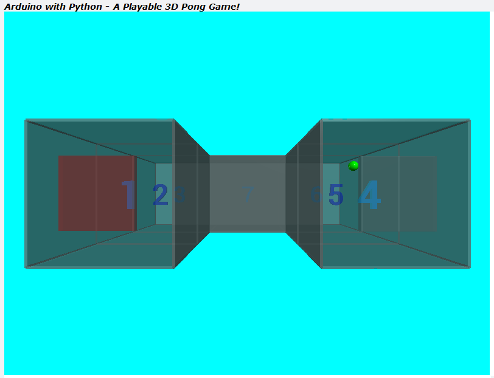
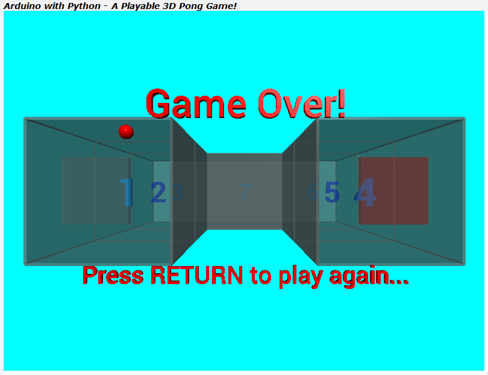

# TTB-AP-Lesson17
My Solution to Paul McWhorter's "Arduino with Python: LESSON 17" homework.

Visit Paul's video here:
 - https://youtu.be/watch?v=cT1JdSNwuhM

You can get Paul's code here:
 - https://toptechboy.com/

You can see my solution demonstrated here:
 - https://youtu.be/NjyYVOQOf0w

This week it was all python code, and some thinking about collision detection. As it happened, the collision detection turned out to be rather simple in the end. The Arduino code and hardware from last week is unchanged.

I now have a playable 3D Pong game in a "U" shaped arena with working bats at each of the open ends of the arena. The aim of the game is to use the bats to stop the bouncing ball from escaping the arena, using the joystick to move the active bat and block the ball. The active bat is swapped by pressing the joystick button. Each time you successfully hit the ball, the bats are made a little smaller. Over on the Arduino and hardware side, the joystick data is continually fed to python and LEDs and a passive piezo buzzer react to the balls position.

## My 3D Pong Game Arena with Bats and a Bouncing Ball - Playing:

## My 3D Pong Game Arena with Bats and a Bouncing Ball - Game Over:

